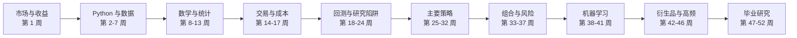

# 量化系统学习项目

这套资料面向零基础学习者。这里的“量化”指**量化研究与量化交易**：把一个投资想法写成明确规则，再用历史数据、统计方法和程序检查它是否有依据、可能怎样亏损，以及扣除交易成本后是否仍值得研究。

本项目不把“回测赚钱”当作成功。**回测**是用历史数据模拟一套规则过去会发生什么；它很容易因为偷看未来、忽略费用或反复挑选参数而显得过分漂亮。真正的学习目标是：你能判断一项研究有没有犯这些错误。

资料核对日期：`2026-08-11`。论文优先使用 DOI 永久链接；DOI 是论文的长期数字标识。开源仓库的活跃情况会随时间变化，因此工具清单记录了核对日期。

## 从这里开始

1. [52 周学习路线](docs/roadmap.md)：从市场常识、数据和统计开始，逐步进入回测、主要策略、组合、机器学习、期权和高频。
2. [论文阅读阶梯](docs/papers.md)：按学习阶段排列经典论文，并说明每篇现在应该读到什么程度。
3. [开源工具、平台与数据源](docs/tools-and-data.md)：说明 GitHub 等平台上的项目分别适合做什么，也标出不适合初学者直接使用的项目。
4. [研究检查表与术语表](docs/checklists-and-glossary.md)：每次让 AI 写策略或回测后，用检查表验收；术语表用于随时查词。

## 一年的主线

这条顺序有意把“复杂模型”放在后面。**模型**是把输入数据转成预测或决策规则的方法。模型越复杂，不代表越容易赚钱；复杂模型往往更容易把历史中的偶然变化误当成规律。

标准进度是每周 `8-10` 小时，共约 `400-500` 小时。如果每周只有 `4-5` 小时，把每一“周”延长成两周即可。不要为了赶进度省略回测与研究陷阱阶段。

## 你、AI 和师傅怎样分工

AI 可以负责：搭建项目、下载与清洗公开数据、写程序和自动测试、制作图表、复现论文方法、排查程序错误。

你必须负责：

- 用自己的话说明策略到底押注什么。
- 确认历史时点真的能看到所用数据。
- 手算至少一个交易例子，核对程序。
- 决定训练期、验证期和最后测试期怎样划分。
- 确认手续费、买卖价差和滑点没有被忽略。
- 说明策略为什么可能有效、什么时候会失效、最多可能亏多少。

师傅最适合做口头验收。每周请他问五个问题：

1. 这个策略到底在押注什么？
2. 为什么其他交易者没有立即消除这个机会？
3. 每次历史决策所用的信息，当时真的已经公开吗？
4. 哪些费用或成交困难可能吃掉收益？
5. 出现什么证据时，你会承认这个想法不成立？

代码由 AI 代写没有问题，但你不能把“运行成功”当成“研究正确”。程序只会忠实执行写进去的假设；假设有错时，程序可能非常准确地算出错误答案。

以后每进入一个项目，我会负责建立代码、依赖、测试、图表和报告；你负责确认研究问题、数据时间、成本和风险。**依赖**是程序运行所需的其他软件库。现在没有预先生成一套庞大的通用交易系统，因为第一个数据练习、因子研究、期权模拟和高频研究需要的工具完全不同。按周建立最小项目，更容易看懂和验收。

## 第一个动作

先完成路线中的第 1 周，不急着下载复杂交易框架。第一个练习只需要十天价格、一张交易账本和一页解释：

`市场数据 -> 交易信号 -> 仓位 -> 买卖 -> 费用 -> 盈亏`

其中，**信号**是规则给出的买入、卖出或持有指示；**仓位**是当前持有多少资产；**盈亏**是赚到或亏掉的金额。能把这条链条说清楚，才进入代码阶段。

## 风险边界

这些资料用于学习和研究，不构成针对个人情况的投资建议。历史回测、论文结论、模拟交易和 AI 生成的代码都不能保证未来盈利。在完成毕业研究和至少 `4-8` 周模拟交易前，不使用真实资金；第一次真实验证也不使用杠杆。**杠杆**是用借款或合约放大持仓，它会同时放大亏损，某些情况下损失可以超过最初投入。

## 本仓库附带的 Opencode Skill

`opencode-skills/quant-data-index/` 是配套的 Opencode Skill，用于在需要时快速查找币圈 / A股 / 港股 / 美股的行情数据下载源、量化算法库和学术论文：

- `SKILL.md`：使用规则、请求头要求、限速与合规底线
- `reference/data-sources.md`：已实测可用的 API 端点、爬虫路径、批量下载地址
- `reference/algorithms.md`：因子挖掘、预测模型、执行算法、开源框架索引
- `reference/papers.md`：arXiv / Crossref / OpenAlex 检索接口与必读清单

原始数据文件（`data/`）不随仓库上传，需要时按 `reference/data-sources.md` 的路径自行抓取。
