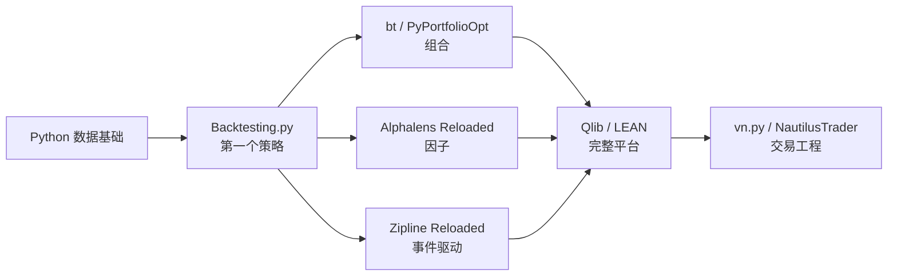

# 开源工具、平台与数据源

核对日期：`2026-08-11`。

这份清单回答三个问题：代码在哪里找、各工具适合学习什么、数据从哪里来。**开源**表示源代码可以查看，但能否修改、发布或用于商业服务仍由许可证决定。**许可证**是作者规定软件可以怎样复制、修改和分发的法律条款。“GitHub 上能看到代码”不一定等于可以随意使用。

仓库的“最后提交”指最近一次代码推送时间，它只能说明维护迹象，不能证明程序正确。GitHub 的星数表示关注度，也不能证明策略有效。

常见许可证可以先分两类：MIT、BSD 和 Apache 通常属于**宽松许可证**，允许在保留版权和许可证声明等条件下修改和再分发；GPL 和 AGPL 属于**强开源义务许可证**，分发修改版时通常需要按相同许可证公开对应源代码，AGPL 还把通过网络提供服务的部分情况包括在内。LGPL 的要求通常比 GPL 更集中在被修改的软件库本身。这里只是学习路线中的通俗区别，实际发布产品前仍需阅读项目的完整许可证。

## 1. 推荐使用顺序

不要一次安装所有项目。每个阶段只使用一个主工具，否则大量时间会花在环境兼容和不同接口上，而不是理解研究逻辑。

## 2. 主路线工具

| 何时使用 | 项目 | 适合学习什么 | 难度与状态 | 结论 |
|---|---|---|---|---|
| 第 2-7 周 | [Python Data Science Handbook](https://github.com/jakevdp/PythonDataScienceHandbook) | Jupyter、NumPy、pandas、Matplotlib 和基础机器学习 | 入门；MIT 许可证；最后提交 2024-06-26 | 稳定教材，提交不频繁不代表过时 |
| 第 18-24 周 | [Backtesting.py](https://github.com/kernc/backtesting.py) | 用日线实现趋势、动量、均值回归；加入手续费、查看交易记录 | 入门到中级；AGPL-3.0；最后提交 2026-08-05 | 第一个回测器首选；先用它发现研究错误 |
| 第 33-37 周 | [bt](https://github.com/pmorissette/bt) | 多资产权重、定期再平衡、资产配置 | 中级；MIT；最后提交 2026-08-07 | 关注“组合持有什么”，不模拟盘口排队 |
| 第 25-32 周 | [Alphalens Reloaded](https://github.com/stefan-jansen/alphalens-reloaded) | 因子分组收益、未来收益、信息系数和换手率 | 中级；Apache-2.0；最后提交 2025-12-15 | 因子研究主工具 |
| 第 33-37 周 | [PyPortfolioOpt](https://github.com/PyPortfolio/PyPortfolioOpt) | 均值-方差、Black-Litterman、协方差收缩和层次风险平价 | 中级；MIT；最后提交 2026-07-07 | 组合优化首选，但必须做样本外检验 |
| 第 18-37 周 | [Pyfolio Reloaded](https://github.com/stefan-jansen/pyfolio-reloaded) / [QuantStats](https://github.com/ranaroussi/quantstats) | 收益、波动、夏普比率、最大回撤和基准比较 | 入门到中级；均为 Apache-2.0 | 负责报告，不会替你发现未来数据泄漏 |
| 第 30-32 周 | [Zipline Reloaded](https://github.com/stefan-jansen/zipline-reloaded) | 按时间处理行情、订单和持仓；股票因子流水线 | 中级；Apache-2.0；最后提交 2026-01-06 | 需要事件驱动流程时使用，不选原 Quantopian 版 |
| 第 38-41 周 | [Machine Learning for Trading](https://github.com/stefan-jansen/machine-learning-for-trading) | 从数据、特征、模型到成本、回测和部署的完整案例 | 中高级；MIT；最后提交 2026-08-11 | 机器学习阶段首选，不能跳过统计与回测基础 |
| 第 38 周以后 | [Microsoft Qlib](https://github.com/microsoft/qlib) | 因子、监督学习、数据处理、组合、回测和执行 | 高级；MIT；最后提交 2026-07-23 | 完整研究平台，不适合第一个月 |
| 第 42 周以后 | [QuantConnect LEAN](https://github.com/QuantConnect/Lean) | 股票、期权、期货、外汇和加密资产的研究、回测、订单与实盘流程 | 中高级；Apache-2.0；最后提交 2026-08-10 | 本地引擎开源；云计算和部分数据可能收费 |
| 毕业后 | [VeighNa/vn.py](https://github.com/vnpy/vnpy) | 国内交易接口、事件引擎、CTA、组合、期权、算法执行和风险控制 | 高级；MIT；最后提交 2026-08-10 | 中国实盘工程生态强，不作为第一门课 |

表中的几个新词：

- **Jupyter Notebook**：把说明文字、程序和运行结果放在同一份交互式文档中的工具。
- **NumPy**：用于高效处理数字数组的 Python 软件库。数组是一组按位置排列的数据。
- **pandas**：用于处理行列式表格和时间序列的 Python 软件库。
- **Matplotlib**：Python 绘图库。
- **信息系数**：因子排序与之后收益排序的一致程度，常写成 IC。它高不代表可以直接交易，还要检查稳定性和成本。
- **事件驱动**：按照行情到达、信号产生、订单提交、订单成交等事件的先后顺序运行程序。
- **均值-方差**：同时考虑预期收益和收益波动来分配组合权重的方法。
- **协方差收缩**：把容易受样本噪声影响的协方差估计向更稳定的简单估计拉近。
- **Black-Litterman**：把市场隐含的均衡预期与研究者观点结合起来的一种组合方法。
- **层次风险平价**：先按资产相似程度分组，再分配风险的组合方法。
- **CTA**：商品交易顾问的英文缩写，在量化语境中常指期货趋势等系统化策略。

## 3. 按专题使用的进阶工具

| 专题 | 项目 | 用途与限制 |
|---|---|---|
| 大量参数实验 | [vectorbt](https://github.com/polakowo/vectorbt) | 能快速测试大量资产和参数，因而也更容易制造过度拟合；中级以后使用。许可证为 Apache-2.0 加 Commons Clause，限制销售主要价值来自该软件的产品或服务 |
| 高级组合风险 | [Riskfolio-Lib](https://github.com/dcajasn/Riskfolio-Lib) | 多种风险度量、风险预算、层次聚类和约束优化；在 PyPortfolioOpt 之后学习 |
| 配对与统计套利 | [ArbitrageLab](https://github.com/hudson-and-thames/arbitragelab) | 协整、均值回复组合、距离法和 Copula；最后提交 2024-05-19，先学回归和平稳性 |
| 强化学习 | [FinRL](https://github.com/AI4Finance-Foundation/FinRL) | 训练、测试、交易三阶段的金融强化学习实验；只放在机器学习末尾 |
| 期权计算 | [QuantLib](https://github.com/lballabio/QuantLib) | 工业级衍生品定价和风险计算；高级，主要语言是 C++ |
| 期权教学 | [Financial Models & Numerical Methods](https://github.com/cantaro86/Financial-Models-Numerical-Methods) | 用 Notebook 学 Black-Scholes、树模型、蒙特卡洛和有限差分 |
| 高频回测 | [hftbacktest](https://github.com/nkaz001/hftbacktest) | 重放订单簿、模拟订单排队和延迟；必须有逐笔成交或订单簿数据 |
| 生产交易系统 | [NautilusTrader](https://github.com/nautechsystems/nautilus_trader) | 确定性的事件驱动回测、实时交易和多市场接入；解决系统工程，不产生交易优势 |
| 加密货币 | [Freqtrade](https://github.com/freqtrade/freqtrade) | 加密货币策略、回测和机器人；GPL-3.0，先使用模拟模式并理解交易所风险 |

新增术语：

- **强化学习**：模型通过行动、结果和奖励反复试验，学习怎样决策。金融数据有限且环境会变化，所以尤其容易学到历史巧合。
- **Copula**：单独描述多个变量各自分布以后，再描述它们怎样共同变化的统计工具。
- **Black-Scholes**：一套经典期权定价模型，依靠若干简化假设计算理论价格。
- **蒙特卡洛模拟**：大量随机生成可能路径，再用结果平均值估计价格或风险。
- **有限差分**：把连续数学方程改写成离散网格上的近似计算。
- **L2/L3 订单簿**：L2 通常包含每档价格的汇总订单量；L3 进一步包含单个订单层面的变化。数据越细，成本和权限要求越高。
- **确定性**：相同输入和配置会得到相同输出，便于复现和排错。

## 4. 数据源分级

数据的来源、使用权和历史真实性与程序同样重要。**API**是程序按照规定格式向数据服务请求信息的接口。免费不等于可以任意转发或商业使用。

### 第一层：官方或学术数据，优先

| 数据源 | 内容 | 用法与限制 |
|---|---|---|
| [FRED](https://fred.stlouisfed.org/) | 美国及全球利率、通胀、就业等宏观时间序列 | 适合宏观练习；部分序列来自第三方，逐项查看来源和许可 |
| [Kenneth French Data Library](https://mba.tuck.dartmouth.edu/pages/faculty/ken.french/data_library.html) | 市场、规模、价值、盈利、投资、动量等研究因子 | 因子论文复现的第一选择；先核对频率、地区和构造说明 |
| [SEC EDGAR APIs](https://www.sec.gov/search-filings/edgar-application-programming-interfaces) | 美国上市公司申报和结构化财务数据 | 官方来源；必须按申报公开日期使用，不能把后来修订值提前 |
| [AQR Data Sets](https://www.aqr.com/Insights/Datasets) | 价值、动量、质量、防御性和趋势等研究数据 | 适合论文对照；查看每套数据的方法和使用条款 |
| [Nasdaq Data Link](https://data.nasdaq.com/) | 金融与经济数据目录 | 部分免费、部分付费；每个数据集许可不同 |

**宏观数据**描述整个经济而不是单一公司，例如利率、通胀和就业。利率是借用资金需要支付或存放资金能够获得的比例；通胀是商品和服务总体价格水平持续上升；公司**基本面**是收入、利润、资产、负债和现金流等经营情况。

### 第二层：学习方便，但要记录限制

| 数据源 | 内容 | 限制 |
|---|---|---|
| [yfinance](https://github.com/ranaroussi/yfinance) | 美股、ETF、指数等 Yahoo 页面数据 | 非 Yahoo 官方项目，只用于个人学习；接口、复权和历史记录可能变化 |
| [AKShare](https://github.com/akfamily/akshare) | A 股、期货、宏观等公开网站数据接口 | 中文友好；项目明确定位学术研究，外部网站变化时接口可能失效 |
| [Tushare](https://tushare.pro/) | 中国股票、基金、期货和宏观数据 | 需要注册令牌，许多接口按积分或权限开放；遵守平台条款 |
| [BaoStock](https://www.baostock.com/) | 中国证券历史行情和部分基本面数据 | 适合学习；正式研究前核对字段、复权和退市样本覆盖 |

### 第三层：真实研究常需要付费或授权

逐笔成交、完整订单簿、历史成分股、精确退市数据、当时版本的财务数据和可靠公司行动记录，往往需要付费数据库或交易所授权。**历史成分股**是指数在每个过去日期真正包含哪些股票；只使用今天的成分股会产生幸存者偏差。

高频项目尤其不能用普通日线代替真实订单簿。缺少所需数据时，正确做法是把项目标成“概念模拟”，而不是把模拟结果描述成可交易证据。

## 5. 去哪里找论文和代码

| 平台 | 适合做什么 | 不能说明什么 |
|---|---|---|
| [GitHub](https://github.com/) | 找源代码、提交历史、问题记录、版本和许可证 | 星数不能证明策略有效 |
| [Gitee 量化搜索](https://so.gitee.com/?q=%E9%87%8F%E5%8C%96&type=repository) | 发现中文项目和国内镜像；核对时约有 `200` 个结果，靠前的真实量化项目包括 vn.py、Northstar、Hikyuu 和 QUANTAXIS | 关键词也会命中与交易无关的“轻量化”等文字；镜像是其他仓库的同步副本，更新可能落后，能找到 GitHub 原仓库时优先核对原仓库 |
| [GitLab quantitative-finance](https://gitlab.com/explore/projects/topics/quantitative-finance) | 补充发现 GitLab 项目 | 该主题公开项目较少，标签也不完整 |
| [Hugging Face Papers](https://huggingface.co/papers/trending) | 发现近期机器学习论文和相关实现 | 热门不等于金融研究可靠；Papers with Code 目前会跳转到这里 |
| [Papers with Code 数据归档](https://github.com/paperswithcode/paperswithcode-data) | 查询旧论文、代码和评测映射 | 数据可能滞后，仍要进入原论文和原仓库核对 |
| [Zenodo](https://zenodo.org/) | 找带永久标识的代码、数据和研究附件 | 上传材料的质量仍需自行判断 |
| [OSF](https://osf.io/) | 找研究计划、数据、代码和复现材料 | 存放在平台不等于已经同行评审 |
| [Kaggle](https://www.kaggle.com/) | 练习数据处理和预测流程 | 比赛分数通常没有交易成本、成交和时间顺序约束 |

**同行评审**是同领域研究者在正式发表前审查方法和论证的过程，它能降低错误概率，但不能保证结论永远正确。**复现**是使用论文所述数据和方法，检查能否得到相近结果。

## 6. 不作为主教材的项目

- 原版 [Quantopian Zipline](https://github.com/quantopian/zipline)、`pyfolio` 和 `alphalens` 已长期缺少主线维护，优先使用社区的 `*-reloaded` 版本。
- [PyAlgoTrade](https://github.com/gbeced/pyalgotrade) 已归档。“归档”表示维护者把仓库设成只读状态。
- [mlfinlab](https://github.com/hudson-and-thames/mlfinlab) 使用自定义订阅协议，不是标准开源许可证；GitHub 上可见不等于可以自由使用。
- [Backtrader](https://github.com/mementum/backtrader) 历史教程很多，但最后代码推送为 2024-08-19。新项目优先使用当前兼容性和文档更清楚的 Backtesting.py。
- [ABIDES](https://github.com/abides-sim/abides) 适合高级市场模拟，不适合零基础主路线。
- [OpenBB](https://github.com/OpenBB-finance/OpenBB) 是数据接入基础设施，不是策略课程；实际数据提供商可能要求各自的密钥和付费许可。

## 7. 每次选择工具前问什么

1. 这个项目解决的是数据、研究、回测、报告还是实盘问题？
2. 它需要的数据，我真的拥有并有权使用吗？
3. 最近版本是否支持当前 Python？
4. 许可证是否允许计划中的用途？
5. 它模拟了哪些现实过程，又省略了哪些过程？
6. 我能否用一个手算小例子验证它？
7. 换一个工具得到不同结果时，差异来自哪里？

框架只是计算器。未来信息泄漏、幸存者偏差、过度拟合、手续费、滑点、冲击和融券成本，必须由研究者主动检查。
